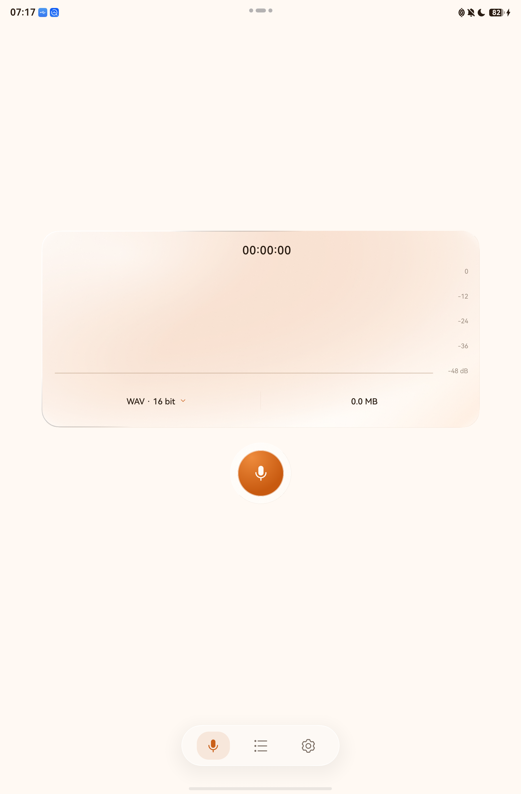

# Facilis Recording

一款简洁、纯离线的 HarmonyOS 原生录音应用。它使用 ArkTS、ArkUI 与系统音频接口实现 WAV、AAC/M4A 和 FLAC 录制、实时波形、本地管理、播放与格式转换。当前版本为 **v3.0.1**，面向 HarmonyOS SDK 6.1.1（API 24）的手机和平板。

> `facilis` 是拉丁语形容词，意为“容易的、简便的”。这里将它作为品牌词与英文 `Recording` 组合；仓库名采用适合 URL 的 `facilis-recording`。

<p align="center">
  
</p>



## 功能

- WAV：44.1/48 kHz、16/24-bit、单声道，应用侧生成标准 RIFF/WAV 文件。
- AAC/M4A：44.1/48 kHz、128/256 kbps、单声道，使用系统 `AVRecorder` 编码封装。
- FLAC：44.1/48 kHz、16-bit、单声道，通过 Native AVCodec 与 AVMuxer 实现无损压缩。
- 录制控制：开始、暂停、继续、删除与保存。
- 实时反馈：连续波浪曲线、分贝刻度、时长和文件大小；暂停冻结，末端柔光。
- 本地管理：搜索、多选、重命名，最近删除支持批量恢复和永久删除；文件操作维护音频与索引一致性。
- 保存与分享：通过系统文件选择器保存原件副本、调用系统分享面板；WAV 可导出无文件头的原始 PCM。
- 格式转换：WAV、FLAC、M4A 在应用内转换，支持进度和取消并保留原件；范围为 44.1/48 kHz、单声道，FLAC 目标限 16-bit。
- 播放：播放/暂停、进度显示和 Seek，处理音频打断、输出设备断开及加载错误。
- 外观：橙色主色、磨砂材质、交互高光与 HDS 浮动底栏，支持浅色/深色及手机和平板响应式布局。
- 页面切换：可左右滑动或点击底部图标；录音和播放的竖屏布局统一，横屏按宽高与可用空间分栏。录音页隐藏文字标题，保留必要的质量、计时和无障碍名称。
- 后台录音：用户开始录音后申请系统录音长时任务，暂停或结束时释放，并显示系统通知。
- 隐私：声明麦克风与后台运行权限，不包含网络权限或第三方运行时 SDK，录音默认保存在应用私有目录。

## 音频实现与质量

核心音频采集、AAC/FLAC 编解码和播放使用官方系统实现；应用代码负责把这些接口连接成可保存、可恢复的录音流程。

| 环节 | 系统接口 | 应用负责的部分 |
| --- | --- | --- |
| 采集 | `AudioCapturer`、`AVRecorder` | 参数核对、录音状态、缓冲写入和异常收尾 |
| 格式转换 | Native `AudioCodec`、`AVDemuxer`、`AVMuxer` | PCM 表示转换、帧边界、进度、取消及文件登记 |
| 播放 | `AVPlayer` | 文件校验、加载/拖动/控制超时、音频打断和资源释放 |

WAV 保存采集到的整数 PCM；支持范围内的 WAV/FLAC 无损转换保留样点。AAC 为有损编码，转成 WAV/FLAC 或提高码率不会恢复此前丢失的信息。24-bit 文件表示存储精度，不代表麦克风具有 24-bit 有效精度。

当前使用默认 `MIC` 音频源，核对的是采集器实际流参数，尚未实现设备最大能力自动探测、`UNPROCESSED` 纯净录音模式或应用级降噪。系统接口说明见[官方音频源](https://github.com/openharmony/docs/blob/master/zh-cn/application-dev/reference/apis-audio-kit/arkts-apis-audio-e.md#sourcetype8)与[音频同步解码](https://developer.huawei.com/consumer/cn/doc/harmonyos-guides/synchronous-audio-decoding)；具体处理和限制见[音频链路](docs/AUDIO_PIPELINE.md)。

后续优化计划：比较普通/纯净采集模式；按设备能力评估声道、位深和采样率扩展；测量底噪、动态范围、失真、帧时间和功耗。上述项目尚未作为已实现功能或音质提升结论。

## 项目结构

```text
.
├── HarmonyRecorder/          # 可直接用 DevEco Studio 打开的应用工程
├── data/                     # 需求、官方设计资料与本项目验收截图
├── docs/                     # 功能、验证、隐私和 AppGallery 发布资料
├── release/                  # 版本说明；二进制位于 GitHub Releases
├── scripts/                  # Host 回归与音频文件校验
└── tools/                    # 可复现的素材生成工具
```

## 环境

- DevEco Studio 6.1.1 或兼容版本
- HarmonyOS SDK 6.1.1 (API 24)
- SDK 自带 Native 工具链（CMake/Clang，用于 FLAC 系统接口桥接）
- Node.js/ohpm/Hvigor（由 DevEco Studio 提供）
- DevEco CLI（推荐）

## 构建

```powershell
Set-Location HarmonyRecorder
devecocli build
devecocli build --modules entry@ohosTest
devecocli build --product default --build-mode release
```

公开仓库不包含证书、Profile、密钥或密码。首次部署到设备前，请在 DevEco Studio 中为自己的应用包名配置调试签名。正式上架必须使用 AGC 云签名或开发者自己的发布证书与 Release Profile。

模型、录音核心、文件仓库、页面操作和播放生命周期的 host 测试命令与覆盖范围见 [测试说明](HarmonyRecorder/README.md#测试)。

## 下载与发布状态

- [下载 v3.0.1](https://github.com/CloudWhiteTower/facilis-recording/releases/tag/v3.0.1)：文档与代码维护版本，整理音频接口分工和转码固定参数名称，保留 v3.0.0 的音频行为。提供 Release HAP、APP ZIP、源码归档与 SHA-256 清单，详见[附件说明](release/v3.0.1/README.md)。代码变更见 [PR #2](https://github.com/CloudWhiteTower/facilis-recording/pull/2)。
- **公开 HAP 需由开发者签名后安装**。附件不包含本地调试证书或设备 Profile；GitHub 发布不代表已通过 AppGallery 审核或上架。
- v3.0.1 Host 185/185、真机相关回归 66/66，Debug/Release/ohosTest 构建通过；本次转换夹具 51 个文件独立解码、5 组无损比较和 15 组 AAC 边界检查通过，见 [v3.0.1 验证](data/v3.0.1-validation/README.md)。
- v3.0.0 Host 回归 185/185，真实 MatePad Air 回归 80/80，十分钟 WAV 实录通过；另通过 PCM 精度检查、66 个文件的完整解码及无损/AAC 边界检查。字体、行高、控件及横竖屏布局已统一。这些结果保留在 [v3.0.0 验证](docs/V3_OPTIMIZATION.md)，v3.0.1 的复验单独记录于[发布说明](release/v3.0.1/README.md)；v2 模拟器结果保留在[历史音频记录](data/audio-functional-validation/README.md)。
- HiSmartPerf 帧时间、功耗、锁屏策略和扬声器/耳机主观听感仍待专门验收；加速测试不计作真实设备长录音。

正式上架还需要开发者本人完成账号实名、APP ID/最终包名确认、发布签名、版权/备案材料和 AGC 提交。逐项状态见 [AppGallery 发布清单](docs/APPGALLERY_RELEASE.md)。

## 文档

- [应用工程说明](HarmonyRecorder/README.md)
- [文档索引](docs/README.md)
- [录音、文件与转换链路](docs/AUDIO_PIPELINE.md)
- [v3 全应用优化与验证](docs/V3_OPTIMIZATION.md)
- [v2 界面与兼容说明](docs/V2_IMPLEMENTATION.md)
- [动画与交互优化](docs/MOTION_IMPLEMENTATION.md)
- [按压光感、文件管理、平板与录音增强](docs/RECORDING_ENHANCEMENTS.md)
- [验收记录](HarmonyRecorder/ACCEPTANCE.md)
- [AppGallery 发布清单](docs/APPGALLERY_RELEASE.md)
- [隐私政策草案](docs/PRIVACY_POLICY_DRAFT.md)
- [应用市场文案](docs/STORE_LISTING_ZH.md)
- [品牌与图标](docs/BRANDING.md)

## 开源许可

除文件头另有说明外，本项目以 [MIT License](LICENSE) 开源。两份由 DevEco 模板生成并保留华为版权头的 Ability 文件继续遵循 Apache License 2.0，详见 [第三方声明](THIRD_PARTY_NOTICES.md)。提交问题或代码前请阅读 [CONTRIBUTING.md](CONTRIBUTING.md)；安全问题请按 [SECURITY.md](SECURITY.md) 中的方式处理。
