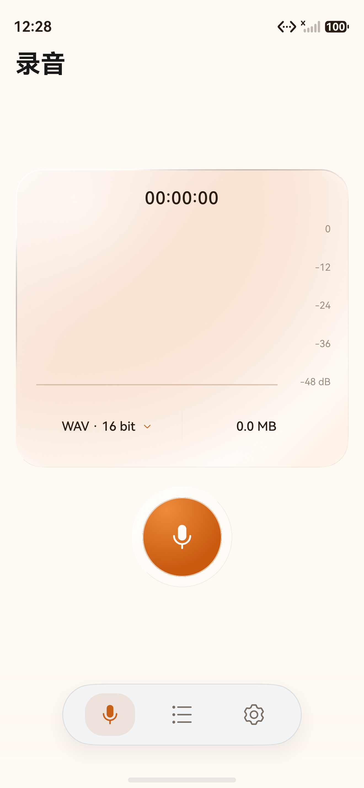

# Facilis Recording

一款简洁、离线优先的 HarmonyOS 原生录音应用。它使用 ArkTS、ArkUI 与系统 Audio Kit 实现 WAV 和 AAC/M4A 录制、实时波形、本地管理与播放。

> `facilis` 是拉丁语形容词，意为“容易的、简便的”。这里将它作为品牌词与英文 `Recording` 组合；仓库名采用适合 URL 的 `facilis-recording`。

<p align="center">
  
</p>



## 功能

- WAV：44.1/48 kHz、16/24-bit、单声道，应用侧生成标准 RIFF/WAV 文件。
- AAC/M4A：44.1/48 kHz、128/256 kbps、单声道，使用系统 `AVRecorder` 编码封装。
- 录制控制：开始、暂停、继续、删除与保存。
- 实时反馈：连续波浪曲线、分贝刻度、时长和文件大小；暂停冻结，末端柔光。
- 本地管理：搜索、多选、重命名、最近删除、恢复、永久删除与系统分享。
- 播放：播放/暂停、进度显示和 Seek。
- 外观：橙色主色、磨砂材质、交互高光与 HDS 浮动底栏，支持浅色/深色及手机和平板响应式布局。
- 隐私：只申请麦克风权限，不包含网络权限或第三方运行时 SDK，录音默认保存在应用私有目录。

## 项目结构

```text
.
├── HarmonyRecorder/          # 可直接用 DevEco Studio 打开的应用工程
├── data/                     # 需求、官方设计资料与本项目验收截图
├── docs/                     # 品牌、隐私和 AppGallery 发布资料
├── release/                  # 版本说明；二进制位于 GitHub Releases
└── tools/                    # 可复现的素材生成工具
```

## 环境

- DevEco Studio 6.1 或兼容版本
- HarmonyOS SDK 6.1.1 (API 24)
- Node.js/ohpm/Hvigor（由 DevEco Studio 提供）
- DevEco CLI（推荐）

## 构建

```powershell
Set-Location HarmonyRecorder
devecocli build
devecocli build --modules entry@ohosTest
devecocli build --product default --build-mode release
```

公开仓库不包含证书、Profile、密钥或密码。首次部署到设备前，请在 DevEco Studio 中为自己的应用包名配置调试签名。正式上架必须使用 AGC 云签名或开发者自己的发布证书与 Release Profile。

## 下载与发布状态

- GitHub Release 提供 ZIP 封装的 Release APP、模拟器验收 HAP、源码归档和 SHA-256 校验文件。
- Release APP 已完成本地 Release 构建，但当前仅作为 AGC 签名/重签名前的交付件；它不是已经通过华为应用市场审核的安装包。
- v1 核心功能已由用户在 Pura 90 与 MatePad Pro 13 模拟器验收；v2 开发版设备单元测试 35/35 通过，最新界面与实时录音效果仍待用户验收。

正式上架还需要开发者本人完成账号实名、APP ID/最终包名确认、发布签名、版权/备案材料和 AGC 提交。逐项状态见 [AppGallery 发布清单](docs/APPGALLERY_RELEASE.md)。

## 文档

- [应用工程说明](HarmonyRecorder/README.md)
- [v2 界面与兼容说明](docs/V2_IMPLEMENTATION.md)
- [验收记录](HarmonyRecorder/ACCEPTANCE.md)
- [AppGallery 发布清单](docs/APPGALLERY_RELEASE.md)
- [隐私政策草案](docs/PRIVACY_POLICY_DRAFT.md)
- [应用市场文案](docs/STORE_LISTING_ZH.md)
- [品牌与图标](docs/BRANDING.md)

## 开源许可

除文件头另有说明外，本项目以 [MIT License](LICENSE) 开源。两份由 DevEco 模板生成并保留华为版权头的 Ability 文件继续遵循 Apache License 2.0，详见 [第三方声明](THIRD_PARTY_NOTICES.md)。提交问题或代码前请阅读 [CONTRIBUTING.md](CONTRIBUTING.md)；安全问题请按 [SECURITY.md](SECURITY.md) 中的方式处理。
