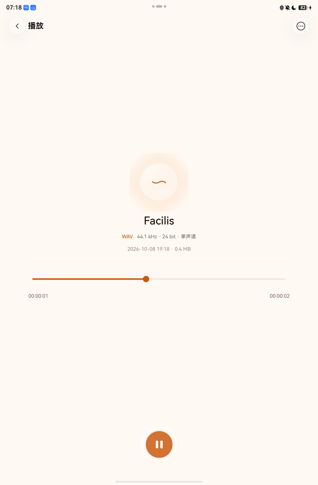
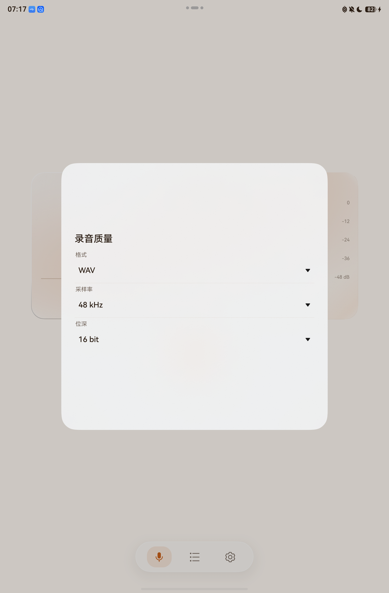
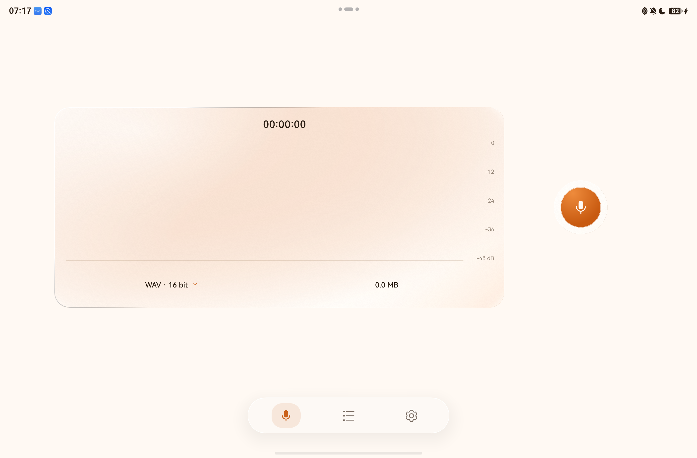
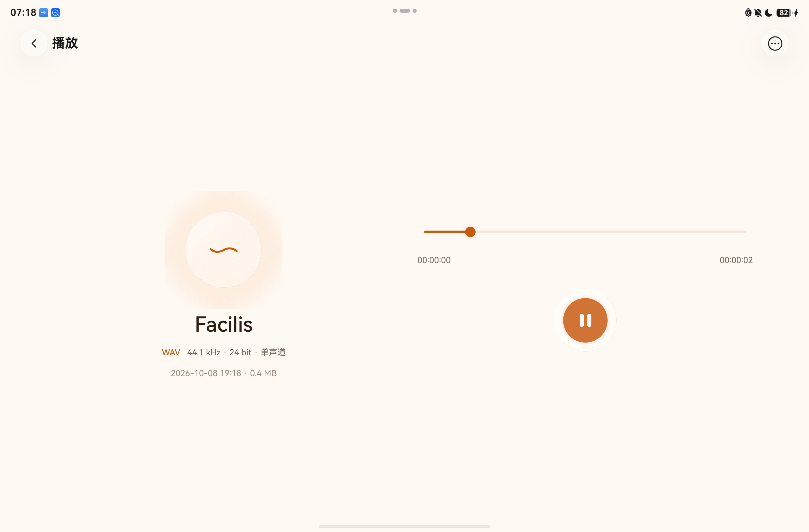

# v3 真机验证记录

日期：2026-10-08。设备：真实 MatePad Air，API 24。最终 Release 已覆盖安装，原有录音保留；本目录公开测试结果、信号统计和界面截图，录音原件留在本地。

## 验证结果

| 范围 | 结果 |
| --- | --- |
| 最终设备回归 | 80/80，失败与错误均为 0；57 项单元及 23 项集成/界面用例 |
| 界面 | 录音控件、质量面板、三页双向滑动、播放器在横竖屏均可使用；控件范围通过检查 |
| 麦克风闭环 | WAV 44.1 kHz / 24 bit、FLAC 48 kHz / 16 bit、AAC 128 kbps，均完成录制、暂停继续、保存、播放与拖动 |
| 十分钟 WAV | 48 kHz / 16 bit / mono，28,831,680 样点，600.66 秒，57,663,404 字节；录制中检查点可解析，结束后保存、打开和播放通过 |
| 独立解码 | FFmpeg 完整解码 66 个文件，无错误；9 组无损对比和 17 组 AAC 尾部/延迟检查通过 |
| 原生 FLAC | 另外 12 个编码文件的 PCM 与已知输入哈希相同，STREAMINFO 样点数及帧大小通过检查 |
| 软件回归 | Host 185/185，C++ PCM 精度与内存检查 5/5，独立报告工具检查 7/7；Debug、Release、测试包构建通过 |
| 文件与设备 | 新建测试记录已清理，原有资料库记录保全检查通过；未发现应用崩溃日志，临时保屏已结束 |

十分钟用例在本轮首次设备回归执行。之后修改集中于应用内转换和测试，录音核心保持相同；最终包再次完成三种格式的短实录回归。加速两小时的数据写入检查、历史模拟器长录音和本轮十分钟实录分别记录，不合并为更长的实录结果。

## 修复与音频信号

本轮修复满输入队列的零等待查询被映射为参数错误、AAC 不完整尾帧丢失，以及解码预热帧被写入转换输出。AAC 尾帧补静音，最多增加 1023 个样点；需要解码依赖的帧仍送入解码器，标记 DISCARD 的输出不写入新文件。边界用例覆盖两种采样率、16/24-bit 输入和 137、1024、1025 样点。17 组 AAC 检查的应用输出与 FFmpeg 解码样点数一致。

| 实录样本 | 解码时长（秒） | RMS（dBFS） | 峰值（dBFS） | 满幅样点 |
| --- | ---: | ---: | ---: | ---: |
| WAV 44.1 kHz / 24 bit | 2.900 | -40.42 | -21.60 | 0 |
| FLAC 48 kHz / 16 bit | 3.080 | -42.09 | -30.18 | 0 |
| AAC / M4A | 3.029 | -40.91 | -24.40 | 0 |
| 十分钟 WAV | 600.660 | -36.61 | -5.99 | 0 |

四个文件均含非零样点。它们是不同时间的独立实录，不能用振幅比较格式音质或麦克风灵敏度。此处验证文件、信号和软件行为；没有测量统一声源下的信噪比、麦克风有效位深、主观听感、HiSmartPerf 帧时间或功耗，也未验证长时间锁屏/后台录音。

机器可读结果：[设备与构建](device-tests.json)、[流式/实录样本](stream-results.json)、[转换与 AAC 边界](conversion-results.json)、[原生 FLAC](flac-results.json)。设备结果记录实际测试 Native 库的 SHA-256，可与发行包中的对应库核对。测试音频不进入公开仓库或发行附件。

## 界面截图

  

完整实现、验证边界与复现命令见 [v3 优化与验证](../../docs/V3_OPTIMIZATION.md)。
