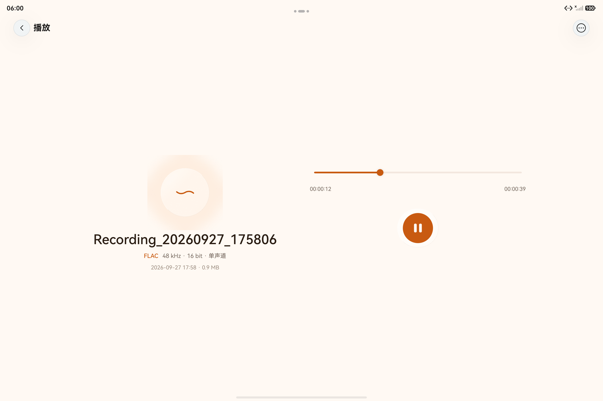

# 录音与交互增强

本轮日期：2026-09-27。面向 API 24 的本地开发改动；公开 v1 Release 不随工作区修改而更新。

## 按压光感

主要按钮通过 `PressFeedback` 接入 UI Design Kit 的 `HdsEffectBuilder.pressShadow(BLEND_WHITE)`，松开、取消或禁用后恢复。主按钮按压缩放至 94%，其他按钮至 97%；系统减少动态效果开启时仍保留光感，但取消缩放。关闭普通 Button 的默认 stateEffect，避免两种按压反馈叠加。

官方依据为 `devecocli docs read 开发指南/UI_Design_Kit_UI设计套件/视效/按压阴影/ui-design-visual-effect-background-color`。这是 API 20 起的 HDS 按压光感，不依赖 API 26 的 uiMaterial。

## 删除与最近删除

资料库使用持续存在的 List 和扁平日期/录音行，避免日期分组的旧数组被复用，也避免最后一条删除时直接拆除列表而截断出场动画。操作面板先完成关闭，再展示确认窗口；文件操作结束后统一提交列表状态。空资料库仍可进入最近删除。

最近删除支持多选、全选、批量恢复和永久删除；操作前显示数量，失败项保留选中并报告成功/失败数。文件仓库使用临时索引文件原子替换、操作日志及失败补偿，避免音频移动成功但索引未更新造成状态不一致。永久删除的不可逆提交点是实际 unlink。

设备回归另外定位了最后一项操作失败的原因：当前 API 24 环境的 `TextEncoder.encodeInto('')` 返回 `undefined`，空索引写入因而中断。现在显式生成空字节数组，并照常同步、原子替换索引。测试适配器也模拟该行为，避免浏览器/Node 的 TextEncoder 行为掩盖平台差异。

系统返回键或蒙层取消确认框时，`showDialog` 的 Promise 以 `Error('cancel')` 结束；现在按正常取消处理。真正的打开错误仍记录日志并提示。平板还出现一次 HDS 标题栏点击中的原生崩溃，触发路径是在点击“多选”的回调中将菜单数组清空；现保留两个菜单节点，并在选择、搜索及操作期间禁用，避免同步销毁正在处理触摸的组件。

## 平板

按照窗口可用宽度布局：录音页宽屏左右分布，播放器足够宽时采用双栏；限制正文最大宽度。小高度窗口允许滚动，宽屏 Sheet 居中。此处的断点依据窗口宽度，分屏下不会仅凭设备类型强行保持平板双栏。

页签内部的 HdsNavigation 明确采用 Stack 模式，避免其自动分栏与页面自己的宽屏布局叠加，将控件挤到左侧导航栏之外。浮动页签的渐变蒙层使用当前主题的实际颜色，避免平板上资源颜色解析为黑色。

## FLAC

提供 44.1/48 kHz、16-bit、单声道 FLAC。`AVRecorder` 在当前 SDK 下不提供 FLAC 输出，因此复用 `AudioCapturer` 的 PCM 采集，通过小型异步 N-API 桥调用系统 Native AVCodec 与 AVMuxer。没有引入第三方编码库。系统每帧 4608 样点，结束时必须送完不足整帧的尾部并处理 EOS；实际行为由设备集成测试及独立解码器核验。

质量页、列表、播放详情及仓库扫描均识别 FLAC。没有索引时通过 STREAMINFO 读取实际音频参数及总采样数，不能用压缩文件体积估算时长。当前 FLAC 不提供 24-bit 选项。

官方依据：`devecocli docs` 的《AVCodec 支持的格式》《音频编码同步模式》与本机 API 24 Native SDK 声明。FLAC 编码同步模式及 FLAC muxer 从 API 20 可用。

边界处理包括：EOS 缓冲只作为结束标记，不重复封装其中残留的上一帧；通过官方 CODEC_DATA 通道提交最终 STREAMINFO，修正系统封装器对极短压缩帧的统计遗漏。总样点数及帧大小采用实际计数，MD5 留零，按 [FLAC 规范](https://www.rfc-editor.org/rfc/rfc9639.html#section-8.2) 表示未知，兼容性由独立解码后的 PCM 字节对比验证。空输入会明确拒绝保存。

## 长录音

PCM 使用有上限的串行写队列，处理部分写入和无进展写入；录音时间使用单调时钟，WAV/FLAC 最终时长按已写入样点计算。WAV 使用 RIFF 32-bit 大小字段，达到上限前停止并保存，不把超限数据长度截断成较小数字。未实现 RF64 或自动分卷。

用户开始录音后申请 AUDIO_RECORDING 长时任务，系统通知可返回应用。暂停、停止、放弃、异常或系统取消时释放采集和后台资源。[官方后台任务说明](https://developer.huawei.com/consumer/cn/doc/doccenter-app-quality/bpta-use-of-background-tasks)解释了后台保活与实际音频业务一致性的要求。

## 本轮验证记录

设备为 API 24 的 Pura 90 和 MatePad Pro 13 **模拟器**。ARM64 与 x86_64 原生库均已构建打包，运行验证在模拟器完成，不能据此宣称实体机功耗、锁屏策略或所有硬件编码器都已验证。

| 检查 | 结果 |
| --- | --- |
| Debug、Release APP、ohosTest 构建 | 均成功 |
| Host 模型 / 录音核心 / 文件仓库 / 页面操作 / 播放生命周期 | 54/54、15/15、15/15、12/12、13/13 |
| MatePad 设备单元测试 | 52/52 |
| FLAC 编码与 AVPlayer 集成测试 | 10/10，含空输入拒绝 |
| 独立 FFmpeg 解码 | 12 份 FLAC 的 PCM 字节及 SHA-256 与输入一致；STREAMINFO 样点数、帧大小正确 |
| 横竖屏录音控件与音质 Sheet 自动操作 | 1/1；已查看两种方向截图 |
| 30 分钟 WAV 实录 | 48 kHz / 16-bit / 单声道，最终 **1857.62 秒（30:57.62）**、89,165,760 样点、178,331,564 字节 |
| WAV 完整性及播放 | RIFF 和 data 长度与实际文件一致；完整解码无错误；系统播放器头、中、尾跳转后均正常推进（1/1） |
| FLAC 麦克风录制 | 48 kHz / 16-bit / 单声道，暂停、继续、保存、回放通过；39.82 秒，981,710 字节，FFmpeg 完整解码无错误 |
| M4A 回归 | AAC / 48 kHz / 单声道 / 128 kbps 配置；保存回放通过，媒体时长 14.442438 秒，231,761 字节，FFmpeg 完整解码无错误 |
| 手机菜单切换 | 10 轮多选/取消/搜索/关闭，5 轮最近删除多选/取消，原崩溃触发组合重走成功；无崩溃日志，历史文件不变 |
| 平板删除闭环 | 两条专用 WAV 经单删确认、最近删除多选、批量永久删除成功；文件和索引都完全清除，包括最后一项清空 |
| 平板菜单与最终布局 | 新版 3 轮选择/搜索及最近删除选择/完成通过；仅有修复前的旧崩溃记录，无新增；横屏资料库、空态与底部渐变正常 |

WAV 在 17:25:45 开始，17:30 左右退到桌面，17:55 返回，17:56 保存；后台期间文件持续增长。每 30 秒采样，共 52 条内存/文件记录，RSS 范围约 235–324 MiB。另有加速两小时 PCM 流测试，验证 691,200,000 字节写入与计时、部分写、队列上限及故障恢复；它不等同于两小时设备实录。传统 RIFF 上限前停止保存已通过边界测试，未实际写满 4 GiB。

可复现的 Host 命令见[工程 README](../HarmonyRecorder/README.md#host-自动化检查)。设备测试入口为 `entry/src/ohosTest/ets/test/DeviceIntegration.test.ets`，默认只执行常规单元测试；`-s integration true` 启用 FLAC，`-s layout true` 启用旋转和 Sheet 操作，`-s playbackFile <应用沙箱文件路径>` 验证已保存文件的跳转播放。拉取生成的 `flac-tests` 后执行 `python scripts/verify-flac-fixtures.py <目录>` 做独立解码校验。

平板最终只读文件核验：资料库音频与索引均为 14 条（12 条原有录音和本轮 FLAC、M4A），最近删除音频与索引均为 0 条；两条专用 WAV 在两个目录和索引中均不存在，无事务日志残留。手机长录 WAV 和平板的两种格式录音保留，便于试听。

按压反馈已接入官方接口并检查普通点击、禁用与释放后的交互状态，未捕获按下瞬间的中间帧，未量测光影峰值、帧率或触摸延迟。真机观感、锁屏长录和功耗仍需在实体设备验收。

数值验证记录：[FLAC 样点校验](../data/recording-validation/flac-verification.json)、[WAV 长录音完整性](../data/recording-validation/wav-soak-result.json)、[删除后的文件和索引](../data/recording-validation/deletion-filesystem-proof.json)。音频文件和设备原始日志仅保留在本地测试目录。
